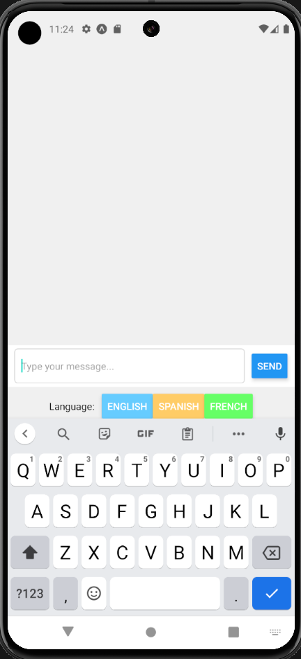
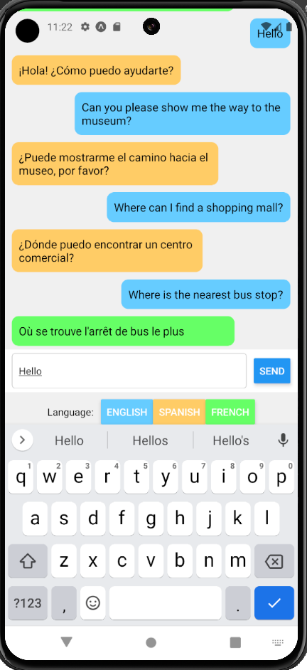
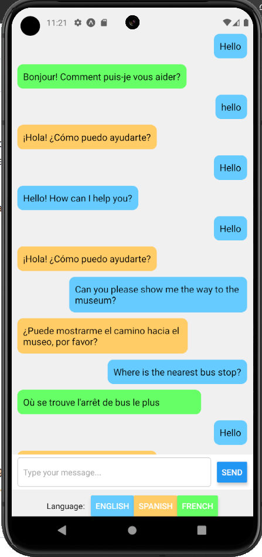

# TECH FOR MOBILE APPS (003)(24SS-Full)

## Instructor: Dr William Akotam Agangiba

## Final Project Team Members:
**Name**: Supraja Bethi                **Email**: bethisa@mail.uc.edu       
**Name**: Sai Murali Maitreya Javvadi  **Email**: javvadsa@mail.uc.edu

**Short-bio**: 
Supraja Bethi and Sai Murali Maitreya collaborated on the final app project, resulting in a comprehensive repository containing all the necessary information, codebase, screenshots, and a demonstration video. Together, they built a React Native travelers' chatbot application aimed at helping users overcome language barriers while exploring new destinations. The app features interactive chatbot functionality, simulated translation features, and a user-friendly interface for seamless communication in foreign languages.

## Repository Information

Respository's URL: https://github.com/Bethisupraja/TravelersChatBot-TechMobileApps

## Demonstration Video
Link to the Video:      
https://mailuc-my.sharepoint.com/:v:/g/personal/javvadsa_mail_uc_edu/Eby8IeuRhW5FryMP92GFzAYB0ZNGRm73hahBq49Ar4GZow?e=QVXGjp

### Implementation Overview:

* Chat Interface: The app presents a chat interface where users can type messages to interact with the chatbot.
  
* Language Selection: Users can select their preferred language (English, Spanish, or French) to communicate with the chatbot.
  
* Message Handling: When a user sends a message, it gets added to the chat history along with a flag indicating whether it's a user message or a bot response.
  
* Simulated Chatbot: The chatbot simulates responses based on the user's messages and the selected language. It includes predefined responses for greetings, inquiries about well-being, farewells, and common travel queries such as asking for directions, finding restaurants, and locating shopping malls.
  
* Translation: The chatbot provides translations for some phrases between English, Spanish, and French. These translations are simulated and stored in the translatedContent object.
User Interaction: Users can interact with the chatbot by typing messages and sending them. The chatbot responds accordingly based on the predefined responses and simulated translation.

### Code Structure:

* App.js: The entry point of the application. It renders the ChatBot component.
  
* Components/ChatBot.js: The ChatBot component contains the main logic and UI for the chatbot functionality. It handles message input, chat history display, language selection, and message sending. It also includes the simulated chatbot logic for generating responses and translations.
  
* Stylesheets: The styles object in the ChatBot.js file contains the styles for different components within the chat interface.
* Technologies Used:
   * React Native: The framework used for building cross-platform mobile applications.
   * JavaScript (ES6+): The programming language used for writing the application logic.
   * React Hooks: Used for managing state and lifecycle methods within functional components.
   * ScrollView: Used for displaying the chat history, allowing users to scroll through past messages.
   * TextInput: Used for capturing user input for sending messages to the chatbot.
   * Button: Used for sending messages and selecting language options.

### Screenshots of the MobileApp
   
   
   

### Conclusion

The React Native travelers' chatbot application provides an intuitive interface for travelers to communicate in foreign languages and overcome language barriers while exploring new destinations. It demonstrates how React Native can be used to build mobile applications with interactive chatbot functionality and simulated translation features.
